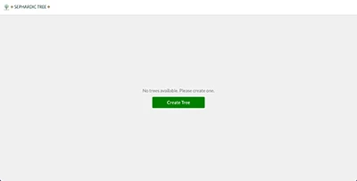
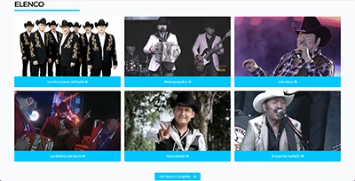

<h1 align="center">About Me</h1>

I'm Cesar Sepulveda. A full-stack Software Engineer specializing in building web applications and services from scratch. I enjoy working with teams of developers to create high-quality applications that solve real-world problems. I am passionate about using the latest technologies to build beautiful and efficient solutions.

<h1 align="center">Skills</h1>

<h1 align="center">Projects</h1>
<table>
<tbody>
  <tr>
    <td width="50%" valign="top">
    <h3 align="center">Sephardic Tree</h3>
         
        
         
        

 
      

        
Web app written in vanilla JavaScript. It allows users to create and build their Family Trees in the format requested by CIL (Lisbon Jewish Community) which is the first step in the process for the user's claim of Portuguese citizenship.

        </td>
    <td width="50%" valign="top">
        <h3 align="center">JOCAR</h3>
         
        
         
        

 
      

        
Website developed for the mexican music label and booking agent JOCAR. Custom functionality written included Artists, Calendar and YouTube video management.
</td>
    
  </tr>
  <tr>
  <td width="50%" valign="top">
        <h3 align="center">Finanzas Digital</h3>
         
        
         
        

 
      

        
Website redeveloped for Finanzas Digital to solve speed and design issues. Several modules were rewritten to preserve critical functionality from previous theme. Loading speeds improved 5 seconds on average.
</td>
  </tr>
</tbody>
</table>

<h1 align="center">Contact</h1>

